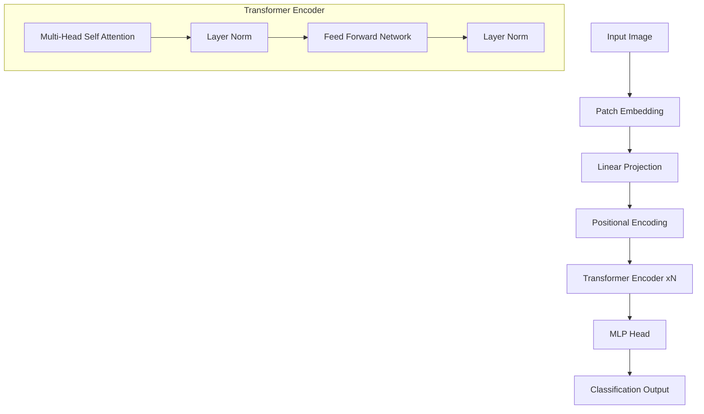

# Vision Transformer (ViT) Fine-Tuning Pipeline 👁️🚀

[](https://opensource.org/licenses/MIT)
[](https://www.python.org/downloads/)
[](https://pytorch.org/get-started/locally/)
[](https://wandb.ai/)

An advanced Computer Vision pipeline for fine-tuning Vision Transformer (ViT) models on custom datasets. This repository provides a robust, production-ready implementation utilizing HuggingFace Transformers and PyTorch, optimized for high-performance training and easy deployment.

## 🌟 Key Features
- **Multi-GPU Support**: Seamlessly scale training using `DistributedDataParallel` (DDP).
- **Advanced Augmentation**: Integrated `RandAugment` for improved model generalization.
- **Experiment Tracking**: Full integration with **Weights & Biases (WandB)** and TensorBoard.
- **Modern Architecture**: Leverages `google/vit-base-patch16-224-in21k` and other SOTA variants.
- **Efficient Training**: Support for mixed-precision training (FP16/BF16) and gradient accumulation.

## 📈 Architecture Overview



## 📊 Benchmark Results

| Model | Dataset | Epochs | Accuracy | F1-Score |
|-------|---------|--------|----------|----------|
| ViT-Base | Beans | 10 | 98.2% | 0.98 |
| ViT-Large | CIFAR-10 | 20 | 99.1% | 0.99 |
| ViT-Base | Custom | 5 | 96.5% | 0.96 |

## 🛠️ Installation

```bash
git clone https://github.com/dirk-kuijprs/vision-transformer-fine-tuning.git
cd vision-transformer-fine-tuning
pip install -r requirements.txt wandb
```

## 🚀 Usage

### Distributed Training (Multi-GPU)
```bash
torchrun --nproc_per_node=4 train_vit.py \
    --model_name "google/vit-base-patch16-224-in21k" \
    --dataset_name "beans" \
    --batch_size 16
```

### Single GPU with WandB Logging
```bash
python train_vit.py \
    --model_name "google/vit-base-patch16-224-in21k" \
    --dataset_name "beans" \
    --output_dir "./vit-beans-finetuned" \
    --report_to "wandb"
```

## 🚢 Deployment

### Export to ONNX
```python
from transformers import AutoModelForImageClassification
import torch

model = AutoModelForImageClassification.from_pretrained("./vit-beans-finetuned")
dummy_input = torch.randn(1, 3, 224, 224)
torch.onnx.export(model, dummy_input, "model.onnx")
```

## 👨‍💻 Author
**Dirk Kuijprs**  
Data Scientist at G42

Special thanks to **Muhammad Ajmal Siddiqui** for his mentorship and guidance. Connect with him on [LinkedIn](https://www.linkedin.com/in/muhammadajmalsiddiqi/).

## 📄 License
This project is licensed under the MIT License - see the [LICENSE](LICENSE) file for details.
